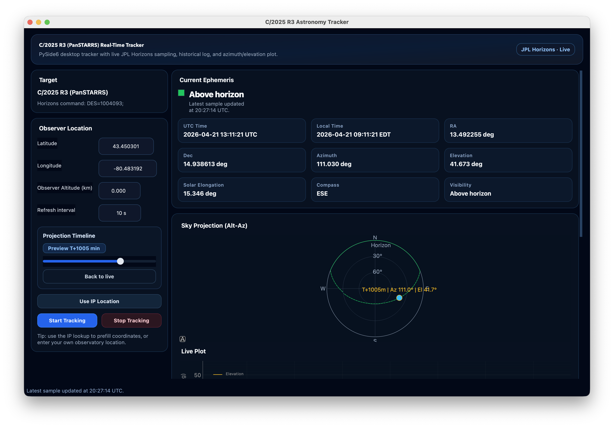

# Astronomy Tracker

A modular desktop astronomy tracker built with Python, PySide6, and JPL Horizons.

This project provides reusable components for tracking astronomical targets with live ephemeris data, forecast preview, and sky projection.



## Features

- Live JPL Horizons sampling for:
  - Azimuth / Elevation
  - RA / Dec
  - Solar elongation
  - Visibility status
- Configurable observer location:
  - Manual coordinates
  - Optional IP-based lookup
- Real-time Alt-Az sky projection
- Split live plots:
  - Elevation vs time
  - Azimuth vs time
- Forecast mode:
  - Timeline preview
  - Back-to-live switching
- Rolling sample log panel
- Rounded app/window icon support from `astronomy/static/solar_system.jpg`
- Modular launcher-based target setup

## Project Structure

- `astronomy/gui.py` - PySide6 GUI, live plotting, forecast timeline
- `astronomy/api_fetcher.py` - Horizons + geolocation API client
- `astronomy/horizons_parser.py` - Horizons response parsing
- `astronomy/timeline.py` - Timeline sample selection helpers
- `astronomy/request_tasks.py` - Background request task wrappers
- `astronomy/tracker_state.py` - Shared state/data models
- `astronomy/static/` - Static assets (icon, screenshots)
- `moon_tracker.py` - Moon launcher
- `mars_tracker.py` - Mars launcher
- `venus_tracker.py` - Venus launcher
- `ISS_tracker.py` - International Space Station launcher
- `c2025r3_tracker.py` - C/2025 R3 launcher
- `target_command.md` - Horizons command reference notes
- `requirements.txt` - Python dependencies

## Requirements

- Python 3.10+
- Internet connection (required for Horizons and IP geolocation)

Install dependencies:

```bash
pip install -r requirements.txt
```

## Usage

Run Moon tracker:

```bash
python moon_tracker.py
```

Run C/2025 R3 tracker:

```bash
python c2025r3_tracker.py
```

Other included launchers:

```bash
python mars_tracker.py
python venus_tracker.py
python ISS_tracker.py
```

## Creating a New Tracker

Create a new launcher file (example: `my_target_tracker.py`):

```python
from astronomy.gui import TrackerAppConfig, run_app
from astronomy.tracker_state import ObserverLocation, TrackerState

APP_CONFIG = TrackerAppConfig(
    app_name="My Target Tracker",
    organization_name="Astronomy",
    window_title="My Target Astronomy Tracker",
    header_title="My Target Real-Time Tracker",
    header_subtitle="PySide6 desktop tracker with live JPL Horizons sampling.",
    target_name="My Target",
    scorer_target_type="deep_sky",  # or: near_solar_comet / planet / moon / default
)

INITIAL_STATE = TrackerState(
    target_command="'TARGET_COMMAND_HERE'",
    location=ObserverLocation(43.2557, -79.8711, 0.10),
    refresh_interval_sec=10,
)

if __name__ == "__main__":
    raise SystemExit(run_app(state=INITIAL_STATE, config=APP_CONFIG))
```

## Target Configuration

Targets are defined using JPL Horizons command syntax.

See `target_command.md` for examples and formatting rules.

## Notes

- Invalid `target_command` values fail at Horizons resolution.
- Update cadence depends on API latency/network quality.
- Forecast quality depends on Horizons data availability.

## Credits
- JPL Horizons: https://ssd.jpl.nasa.gov/horizons/
- IP Geolocation: https://ipinfo.io/
- Weather Data: https://open-meteo.com/
