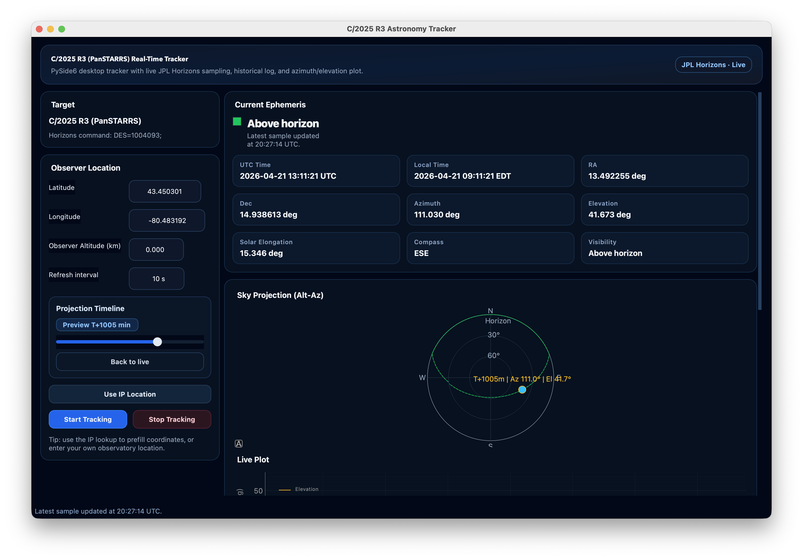

# Astronomy Tracker

A modular desktop astronomy tracker built with Python, PySide6, and JPL Horizons.

This project provides reusable components for tracking astronomical targets with live ephemeris data, forecast preview, and sky projection.



## Features

- Live JPL Horizons sampling for:
  - Azimuth / Elevation
  - RA / Dec
  - Solar elongation
  - Visibility status
- Configurable observer location:
  - Manual coordinates
  - Optional IP-based lookup
- Real-time Alt-Az sky projection
- Split live plots:
  - Elevation vs time
  - Azimuth vs time
- Forecast mode:
  - Timeline preview
  - Back-to-live switching
  - Selectable horizon from 6 hours to 30 days
- Rolling sample log panel
- Rounded app/window icon support from `astronomy/static/solar_system.jpg`
- Modular launcher-based target setup
- Meteor shower tracking with radiant position, activity profile, and estimated hourly rate

## Project Structure

- `astronomy/gui.py` - PySide6 GUI, live plotting, forecast timeline
- `astronomy/api_fetcher.py` - Horizons + geolocation API client
- `astronomy/horizons_parser.py` - Horizons response parsing
- `astronomy/forecast.py` - Forecast horizon options and sampling-step policy
- `astronomy/celestial.py` - Local sun/moon/sidereal-time math for targets Horizons cannot serve
- `astronomy/meteor_showers.py` - Radiant and activity data for the major annual showers
- `astronomy/meteor_fetcher.py` - Locally computed radiant ephemeris provider
- `astronomy/timeline.py` - Timeline sample selection helpers
- `astronomy/request_tasks.py` - Background request task wrappers
- `astronomy/tracker_state.py` - Shared state/data models
- `astronomy/static/` - Static assets (icon, screenshots)
- `moon_tracker.py` - Moon launcher
- `mars_tracker.py` - Mars launcher
- `venus_tracker.py` - Venus launcher
- `ISS_tracker.py` - International Space Station launcher
- `c2025r3_tracker.py` - C/2025 R3 launcher
- `perseids_tracker.py` - Perseid meteor shower launcher
- `target_command.md` - Horizons command reference notes
- `requirements.txt` - Python dependencies

## Requirements

- Python 3.10+
- Internet connection (required for Horizons and IP geolocation)

Install dependencies:

```bash
pip install -r requirements.txt
```

## Usage

Run Moon tracker:

```bash
python moon_tracker.py
```

Run C/2025 R3 tracker:

```bash
python c2025r3_tracker.py
```

Run the Perseid meteor shower tracker:

```bash
python perseids_tracker.py
```

Other included launchers:

```bash
python mars_tracker.py
python venus_tracker.py
python ISS_tracker.py
```

## Forecast Horizon

The **Forecast** control next to the timeline selects how far ahead the
projection reaches, from 6 hours to 30 days. A launcher can preset it with
`prediction_horizon_minutes`.

The sampling step is derived, not chosen: reaching further ahead widens the step
so the request stays about the same size. Each provider declares its own budget
via `MAX_RANGE_SAMPLES`, so a horizon costs what the provider can afford:

| Horizon | Horizons target | Meteor shower radiant |
| ------- | --------------- | --------------------- |
| 24 hours | 5 min steps, 289 samples | 5 min steps, 289 samples |
| 7 days   | 21 min steps, 481 samples | 5 min steps, 2017 samples |
| 30 days  | 87 min steps, 497 samples | 10 min steps, 4321 samples |

Radiant samples are local arithmetic, so a shower keeps 5-minute resolution out
to a fortnight; a Horizons target coarsens instead of issuing a huge query. The
refresh cadence stretches with the horizon too, since a month-long forecast does
not change minute to minute.

The time-series plots do not auto-range on the time axis, because a forecast
running weeks ahead would squeeze the live trace into an invisible sliver. They
hold a fixed span — one hour by default — and slide to keep the displayed moment
centred, with live data to the left of the cursor and the forecast to the right.
Ctrl/Cmd + scroll changes the span, and the new width is kept as the view
follows along. Dragging the timeline moves the centre to the selected moment,
which is how a multi-day forecast is browsed. **Reset All Plots** restores the
default span without leaving the moment on screen.

Weather comes from Open-Meteo's 16-day forecast. Samples beyond that are scored
without weather rather than with present-day conditions, so a long forecast
reflects astronomical circumstances only once it runs past the weather horizon.

## Meteor Showers

A meteor shower has no Horizons ephemeris: it is not a body but a stream of
debris the Earth passes through, seen as meteors diverging from a fixed radiant.
`astronomy/meteor_fetcher.py` computes the radiant position locally instead, so
shower trackers need no network access for their ephemeris and produce the
24-hour forecast instantly.

Ten showers are tabulated in `astronomy/meteor_showers.py` (Quadrantids, Lyrids,
eta Aquariids, Southern delta Aquariids, Perseids, Draconids, Orionids, Leonids,
Geminids, Ursids). Each carries its radiant and nightly drift, peak solar
longitude, activity profile, and population index.

Showers are scored differently from point targets, because:

- Meteors appear all over the sky, so the Moon's distance from the radiant is
  irrelevant and solar elongation is meaningless. Only sky brightness matters.
- The rate scales with the sine of the radiant's altitude.
- The date matters on its own. A well-placed radiant under a clear sky is still
  a quiet night two weeks off the stream's peak.

Alongside the usual 0-100 score, the shower scorer reports an estimated
`meteors/hr`, the current `ZHR`, and the assumed `limiting mag`. The rate
assumes a magnitude 6.0 sky; a darker site yields more, a light-polluted one
fewer.

To track a different shower, point a launcher at its code:

```python
from astronomy.meteor_fetcher import MeteorRadiantFetcher
from astronomy.meteor_showers import get_shower, shower_target_command

GEMINIDS = get_shower("GEM")

APP_CONFIG = TrackerAppConfig(
    target_name=GEMINIDS.name,
    scorer_target_type="meteor_shower_gem",
    fetcher_factory=MeteorRadiantFetcher,
    auto_ip_location=True,
    prediction_horizon_minutes=7 * 24 * 60,
    # ... remaining fields as usual
)

INITIAL_STATE = TrackerState(
    target_command=shower_target_command(GEMINIDS),  # "SHOWER=GEM"
    location=ObserverLocation(43.2557, -79.8711, 0.10),
)
```

## Creating a New Tracker

Create a new launcher file (example: `my_target_tracker.py`):

```python
from astronomy.gui import TrackerAppConfig, run_app
from astronomy.tracker_state import ObserverLocation, TrackerState

APP_CONFIG = TrackerAppConfig(
    app_name="My Target Tracker",
    organization_name="Astronomy",
    window_title="My Target Astronomy Tracker",
    header_title="My Target Real-Time Tracker",
    header_subtitle="PySide6 desktop tracker with live JPL Horizons sampling.",
    target_name="My Target",
    # or: near_solar_comet / planet / moon / meteor_shower_<code> / default
    scorer_target_type="deep_sky",
)

INITIAL_STATE = TrackerState(
    target_command="'TARGET_COMMAND_HERE'",
    location=ObserverLocation(43.2557, -79.8711, 0.10),
    refresh_interval_sec=10,
)

if __name__ == "__main__":
    raise SystemExit(run_app(state=INITIAL_STATE, config=APP_CONFIG))
```

## Target Configuration

Targets are defined using JPL Horizons command syntax, except meteor showers,
which use `SHOWER=<IAU code>`.

See `target_command.md` for examples and formatting rules.

## Notes

- Invalid `target_command` values fail at Horizons resolution.
- Update cadence depends on API latency/network quality.
- Forecast quality depends on Horizons data availability.
- Meteor shower radiants are computed locally, so they need no network access
  and work offline apart from weather and IP geolocation.
- Shower ZHR, slope, and population index figures are approximate literature
  values describing a typical return, not a prediction for a specific year.

## Credits
- JPL Horizons: https://ssd.jpl.nasa.gov/horizons/
- IP Geolocation: https://ipinfo.io/
- Weather Data: https://open-meteo.com/
